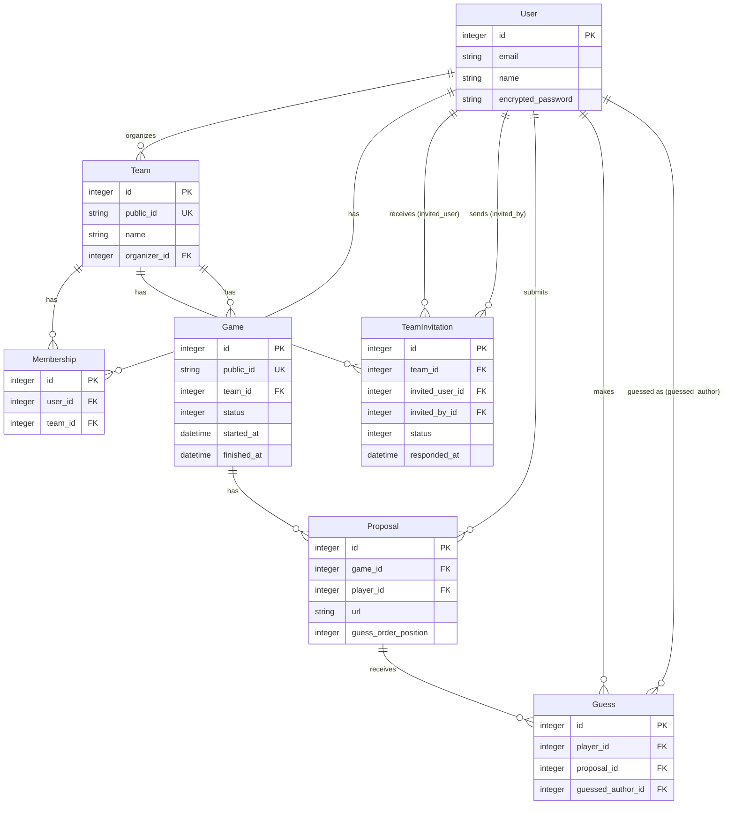

# 🎵 HitGuessr


**A multiplayer music guessing game where friends try to identify who submitted which song.**

[Features](#-features) • [Quick Start](#-quick-start) • [Gameplay](#-gameplay) • [Tech Stack](#-tech-stack) • [API](#-api-routes) • [Changelog](#-changelog) • [Development](#-development)

---

## ✨ Features

- 🤝 **Team member autonomy** — Any team member (including the organizer) can launch, start guessing, and finish a game; cancel game and membership management remain organizer-only
- 🔢 **Team-scoped game numbering** — Each team has its own stable sequential game counter (1, 2, 3 …) displayed consistently across all views
- 📩 **Team invite flow** — Adding a member now sends a pending invitation; the invitee accepts or refuses from `/teams` and active membership is only granted on explicit acceptance
- 🎧 **Team-based gameplay** — Create teams, invite friends, and play together
- 🎵 **Music proposals** — Submit YouTube or any music URL anonymously
- ✏️ **Proposal edit window** — A player can edit their own proposal while the game is in collecting phase; once guessing starts, proposal changes are locked
- 🤔 **Guessing phase** — Try to match each song to its submitter
- ⚠️ **Duplicate guess warning** — Real-time inline indicators highlight duplicate selections during guessing; a blocking confirmation modal details conflicts before submission, while still allowing intentional duplicates
- 🔀 **Randomized guess order** — Proposals are shuffled per round and stay stable for all players during guessing
- 👥 **Minimum team size to start** — Organizers can start a game only when the team has at least 3 members
- 🚪 **Self-leave team** — A member can quit their team with confirmation (organizer cannot leave their own team)
- 🏆 **Leaderboard** — Scores and rankings with tie handling
- 👤 **User authentication** — Secure sign-up/login with Devise
- 🌙 **Dark neon theme** — Stylish music-inspired UI with glowing effects
- � **Public URL IDs** — Games and teams use short public identifiers (`gm_`, `tm_`) instead of numeric IDs in URLs for privacy and shareability
- �📱 **Responsive design** — Works on desktop and mobile

---

## 🚀 Quick Start

### Prerequisites

- **Ruby 3.4.6** (check with `ruby -v`)
- **Bundler** (`gem install bundler`)
- **Node.js** (for Tailwind CSS compilation)

### Installation

```bash
# Clone the repository
git clone https://github.com/your-username/hitguessr.git
cd hitguessr

# Install dependencies
bundle install

# Setup database (creates, migrates, and seeds)
bin/rails db:setup

# Start the development server
bin/dev
```

The app will be available at **<http://localhost:3000>**

### Demo Account

After seeding, you can log in with:

| Email                 | Password       |
| --------------------- | -------------- |
| `jean@example.com`    | `password123`  |
| `marie@example.com`   | `password123`  |
| `pierre@example.com`  | `password123`  |
| `sophie@example.com`  | `password123`  |
| `lucas@example.com`   | `password123`  |

A demo team "**Les Mélomanes**" is pre-created with a finished game showing the scoring system.

---

## 🎧 Gameplay

### Game Flow

```text
┌─────────────────────────────────────────────────────────────────────┐
│                          GAME PHASES                                │
├─────────────────┬─────────────────────┬─────────────────────────────┤
│   COLLECTING    │      GUESSING       │         FINISHED            │
│                 │                     │                             │
│  Players submit │  Players guess who  │  Scores calculated and      │
│  music URLs     │  submitted what     │  rankings displayed         │
│  (anonymous)    │                     │                             │
└────────┬────────┴──────────┬──────────┴──────────────┬──────────────┘
         │                   │                         │
    Auto or Manual      Auto or Manual            Automatic
    (all submitted)    (all guesses done)        after all guesses
```

### Roles

| Role                               | Action                                                  | Autorisé |
| ---------------------------------- | ------------------------------------------------------- | -------- |
| **All members** (organizer incl.)  | Launch a game (≥ 3 members)                             | ✅       |
| **All members** (organizer incl.)  | Start guessing phase                                    | ✅       |
| **All members** (organizer incl.)  | Finish game                                             | ✅       |
| **Organizer only**                 | Cancel an active game                                   | ✅       |
| **Organizer only**                 | Invite a member to the team (by email)                  | ✅       |
| **Organizer only**                 | Remove a member from the team                           | ✅       |
| **Invitee only**                   | Accept or refuse a pending invitation                   | ✅       |
| **Any player**                     | Submit a music proposal                                 | ✅       |
| **Any player**                     | Make guesses during guessing phase                      | ✅       |
| **Any member**                     | Leave the team (no active game)                         | ✅       |
| **Organizer**                      | Leave their own team                                    | ❌       |

> Note: The organizer is also a player and participates in the game.

### Phase Transitions

- **Automatic**: When 100% of players have submitted, the game progresses automatically
- **Manual**: Any team member can also manually advance phases at any time
- Players are notified when automatic transitions occur

### Rules

1. **One proposal per player** — Each player submits exactly one music URL per game
2. **Proposal editable only in collecting** — A player can update their own proposal until guessing starts; after transition, edits are blocked
3. **No duplicates** — The same URL cannot be submitted twice in the same game
4. **Anonymous proposals** — Players cannot see others' submissions during collection
5. **Randomized & frozen guess order** — At guessing start, proposal order is shuffled once per game and shared identically for all players
6. **Complete guesses** — All proposals must be matched to a player to submit guesses
7. **No self-guessing** — Players cannot guess their own proposal (excluded automatically)
8. **Minimum 3 members to start** — A new game can be launched only if the team has at least 3 active members

### Scoring

- **+1 point** for each correct guess
- **Ties** — Players with equal scores share the same rank
- **Missing participation** — Players who don't submit proposals or guesses score 0

---

## 🛠 Tech Stack

| Layer               | Technology                                          |
| ------------------- | --------------------------------------------------- |
| **Framework**       | Ruby on Rails 8.1                                   |
| **Database**        | SQLite 3 (development), configurable for production |
| **Authentication**  | Devise 5.0                                          |
| **Frontend**        | Hotwire (Turbo + Stimulus)                          |
| **CSS**             | Tailwind CSS 4 with custom neon theme               |
| **Asset Pipeline**  | Propshaft + Importmap                               |
| **Background Jobs** | Solid Queue                                         |
| **Caching**         | Solid Cache                                         |
| **WebSockets**      | Solid Cable                                         |
| **Deployment**      | Kamal + Docker                                      |

---

## 📊 Data Model



### Game Statuses

| Status       | Value | Description                              |
| ------------ | ----- | ---------------------------------------- |
| `collecting` | 0     | Players are submitting music URLs        |
| `guessing`   | 1     | Players are guessing who submitted what  |
| `finished`   | 2     | Game ended, scores displayed             |

---

## 🔗 API Routes

### Authentication (Devise)

| Method | Path                    | Description       |
| ------ | ----------------------- | ----------------- |
| GET    | `/users/sign_in`        | Login page        |
| POST   | `/users/sign_in`        | Create session    |
| DELETE | `/users/sign_out`       | Logout            |
| GET    | `/users/sign_up`        | Registration page |
| POST   | `/users`                | Create account    |
| GET    | `/users/password/new`   | Forgot password   |

### Teams

| Method | Path                     | Description       |
| ------ | ------------------------ | ----------------- |
| GET    | `/teams`                 | List user's teams |
| GET    | `/teams/new`             | New team form     |
| POST   | `/teams`                 | Create team       |
| GET    | `/teams/:public_id`      | Show team details |
| GET    | `/teams/:public_id/edit` | Edit team form    |
| PATCH  | `/teams/:public_id`      | Update team       |
| DELETE | `/teams/:public_id`      | Delete team       |

### Memberships

| Method | Path                                     | Description        |
| ------ | ---------------------------------------- | ------------------ |
| DELETE | `/teams/:team_public_id/memberships/:id` | Remove member      |
| DELETE | `/teams/:team_public_id/leave`           | Leave current team |

### Invitations

| Method | Path                                                | Description                          |
| ------ | --------------------------------------------------- | ------------------------------------ |
| POST   | `/teams/:team_public_id/invitations`                | Invite a member by email (organizer) |
| PATCH  | `/teams/:team_public_id/invitations/:id/accept`     | Accept a pending invitation          |
| PATCH  | `/teams/:team_public_id/invitations/:id/refuse`     | Refuse a pending invitation          |

### Games

| Method | Path                                   | Description                                       |
| ------ | -------------------------------------- | ------------------------------------------------- |
| GET    | `/teams/:team_public_id/games`         | List team's games                                 |
| GET    | `/teams/:team_public_id/games/new`     | New game form                                     |
| POST   | `/teams/:team_public_id/games`         | Start new game (requires at least 3 team members) |
| GET    | `/games/:public_id`                    | Show game state                                   |
| DELETE | `/games/:public_id`                    | Cancel game (organizer only)                      |
| PATCH  | `/games/:public_id/start_guessing`     | Transition to guessing phase                      |
| PATCH  | `/games/:public_id/finish`             | End the game                                      |

### Proposals

| Method | Path                                   | Description          |
| ------ | -------------------------------------- | -------------------- |
| GET    | `/games/:game_public_id/proposals/new` | Submit proposal form |
| POST   | `/games/:game_public_id/proposals`     | Create proposal      |
| GET    | `/games/:game_public_id/proposals/:id` | View proposal        |

### Guesses

| Method | Path                                 | Description        |
| ------ | ------------------------------------ | ------------------ |
| GET    | `/games/:game_public_id/guesses/new` | Guessing form      |
| POST   | `/games/:game_public_id/guesses`     | Submit all guesses |

### Results

| Method | Path                             | Description            |
| ------ | -------------------------------- | ---------------------- |
| GET    | `/games/:game_public_id/results` | View scores & rankings |

---

## 🧑‍💻 Development

### Running the Server

```bash
# Development mode with Tailwind watch
bin/dev

# Or separately:
bin/rails server
bin/rails tailwindcss:watch
```

### Building Tailwind CSS

Use these commands when you want to compile Tailwind styles manually.

```bash
# One-time build
bin/rails tailwindcss:build

# Continuous build (watch mode)
bin/rails tailwindcss:watch

# Production build (minified)
RAILS_ENV=production bin/rails tailwindcss:build
```

### Database Commands

```bash
# Create database
bin/rails db:create

# Run migrations
bin/rails db:migrate

# Seed demo data
bin/rails db:seed

# Reset everything (drop + create + migrate + seed)
bin/rails db:reset

# Full setup
bin/setup
```

### Testing

```bash
# Run all tests
bin/rails test

# Run system tests
bin/rails test:system

# Run specific test file
bin/rails test test/models/game_test.rb
```

### Code Quality

```bash
# Run Rubocop linter
bin/rubocop

# Security audit
bin/brakeman
bin/bundler-audit
```

### Console

```bash
# Rails console
bin/rails console

# Example: Create a user
User.create!(name: "Test", email: "test@example.com", password: "password123")

# Example: View game ranking
Game.last.ranking
```

---

## 🐳 Docker Deployment

The provided `Dockerfile` is production-oriented (Rails 8 + Thruster, exposed on port `80`).

### Run with Docker (single host)

- Build the image:

```bash
docker build -t hitguessr:latest .
```

- Choose one runtime mode:

#### Option A: Without persistent volume (ephemeral)

Use this for quick tests only. Data in `/rails/storage` is lost when the container is removed.

```bash
docker run -d \
    --name hitguessr \
    -p 80:80 \
    -e RAILS_MASTER_KEY="$(cat config/master.key)" \
    hitguessr:latest
```

#### Option B: With persistent volume (recommended)

Use this for real usage. SQLite and Active Storage files are kept across container recreation.

```bash
docker volume create hitguessr_storage

docker run -d \
    --name hitguessr \
    -p 80:80 \
    -e RAILS_MASTER_KEY="$(cat config/master.key)" \
    -v hitguessr_storage:/rails/storage \
    hitguessr:latest
```

- Check startup logs:

```bash
docker logs -f hitguessr
```

Notes:

- Container entrypoint automatically runs `bin/rails db:prepare` when starting the Rails server.
- App data (including SQLite production DB) is stored under `/rails/storage`; keep a mounted volume to avoid data loss.
- Open `http://localhost` after startup.

Useful commands:

```bash
docker stop hitguessr
docker start hitguessr
docker rm -f hitguessr
docker exec -it hitguessr bash
```

### Deploy with Kamal

- Update `config/deploy.yml`:

  - Set real host(s) in `servers.web`.
  - Set `registry.server` and registry auth if needed.
  - Keep `RAILS_MASTER_KEY` in `env.secret` (already configured).
  - Keep persistent volume mapping for `/rails/storage` (already configured).

- Configure secrets in `.kamal/secrets`:

```bash
RAILS_MASTER_KEY=$(cat config/master.key)
# KAMAL_REGISTRY_PASSWORD=...   # required for authenticated registries
```

- First deployment:

```bash
bin/kamal setup
bin/kamal deploy
```

- Day-2 operations:

```bash
bin/kamal deploy        # rolling update
bin/kamal logs -f       # follow logs
bin/kamal app exec --interactive --reuse "bin/rails console"
```

Architecture note:

- `config/deploy.yml` currently sets `builder.arch: amd64`; on Apple Silicon, builds use emulation unless you configure a remote amd64 builder.

### Troubleshooting Docker

- `Missing RAILS_MASTER_KEY`:
Set the env var when running the container:

```bash
docker run ... -e RAILS_MASTER_KEY="$(cat config/master.key)" ...
```

- `Bind for 0.0.0.0:80 failed: port is already allocated`:
Use another host port, for example:

```bash
docker run -d --name hitguessr -p 3000:80 ... hitguessr:latest
```

Then open `http://localhost:3000`.

- Data lost after container recreation:
Make sure `/rails/storage` is mounted to a named volume:

```bash
docker volume create hitguessr_storage
docker run -d -v hitguessr_storage:/rails/storage ...
```

- Container starts then exits:
Inspect logs and Rails boot output:

```bash
docker logs hitguessr
docker ps -a --filter name=hitguessr
```

- Slow image build on Apple Silicon:
`config/deploy.yml` is pinned to `amd64`. For faster builds, use a remote amd64 builder via Kamal.

---

## 📁 Project Structure

```text
hitguessr/
├── app/
│   ├── controllers/
│   │   ├── games_controller.rb
│   │   ├── guesses_controller.rb
│   │   ├── home_controller.rb
│   │   ├── invitations_controller.rb
│   │   ├── memberships_controller.rb
│   │   ├── proposals_controller.rb
│   │   ├── results_controller.rb
│   │   └── teams_controller.rb
│   ├── models/
│   │   ├── game.rb
│   │   ├── guess.rb
│   │   ├── membership.rb
│   │   ├── proposal.rb
│   │   ├── team.rb
│   │   ├── team_invitation.rb
│   │   └── user.rb
│   ├── views/            # ERB templates
│   ├── assets/
│   │   └── tailwind/     # Custom CSS with neon theme
│   └── javascript/
│       └── controllers/  # Stimulus controllers
│           ├── guess_duplicates_controller.js
│           └── youtube_preview_controller.js
├── config/
│   ├── routes.rb         # URL routing
│   ├── locales/          # i18n (French)
│   └── initializers/     # Devise, etc.
├── db/
│   ├── migrate/          # Database migrations
│   ├── schema.rb         # Current schema
│   └── seeds.rb          # Demo data
├── specs/                # Feature specifications (001–015)
│   └── NNN-feature-name/
│       ├── spec.md        # Full feature spec
│       ├── plan.md        # Tech stack & file structure
│       ├── tasks.md       # Implementation task list
│       ├── data-model.md  # Entity definitions
│       ├── research.md    # Technical decisions
│       ├── quickstart.md  # Integration scenarios
│       ├── checklists/    # Pre-implementation checklists
│       └── contracts/     # API / test contracts
└── test/                 # Test suite (Minitest + Capybara)
    ├── controllers/
    ├── models/
    ├── integration/
    └── system/
```

---

## 🌐 Localization

The app is localized in **French** by default. Translation files are in `config/locales/`:

- `fr.yml` — General translations
- `devise.fr.yml` — Authentication messages

---

## 📋 Changelog

### v1.5.0 *(March 30, 2026)*

- **docs** - Website URL updated from `https://hitguessr.hopto.org` to `https://hitguessr.saumon.cc`

### v1.4.0 *(March 14, 2026)*

- 🔢 **Team-scoped game numbering** — Each team now has its own sequential game counter (1, 2, 3 …) stored as `team_game_number` on every game record. Numbers are stable forever: deletion of a game does not renumber others, and the team cannot be reassigned after creation. A bounded retry (up to 3 attempts, backoff 10/25/50 ms) handles concurrent collisions transparently. All views (team page, game list, game detail, results) are aligned to display this team-local number instead of the global database ID. Historical parties are backfilled automatically by the migration ([#018](specs/018-team-game-numbering/spec.md))

### v1.3.5 *(March 13, 2026)*

- 🔗 **Public URL IDs** — Games and teams now use short public identifiers (`gm_<8chars>` for games, `tm_<8chars>` for teams) instead of numeric IDs in all public-facing URLs. Numeric and malformed IDs on public endpoints return 404 with no redirect or information leak. Existing records are backfilled automatically via migration. All URL helpers, controllers, and views updated for seamless public-id routing ([#017](specs/017-public-url-ids/spec.md))
- 🐳 **Docker deployment docs clarified** — Expanded the README Docker section with two explicit runtime modes: without persistent volume (ephemeral) and with persistent volume (recommended). Added operational notes on `/rails/storage` persistence, startup behavior (`db:prepare` via entrypoint), and a focused troubleshooting checklist (missing `RAILS_MASTER_KEY`, port conflicts, data persistence, startup failures, and Apple Silicon `amd64` build note).
- ⚙️ **Chore** — dependency updates

### v1.3.4 *(March 4, 2026)*

- 🚀 **Production server update script** — Added `script/update_production_server.sh`, an automated update script that prevents concurrent runs with a lock, stops the Puma service, updates the `master` branch in fast-forward-only mode, installs dependencies, precompiles assets, runs migrations, restarts the service, and attempts an automatic restart on failure.
- 🌍 **i18n fallback fix (leave-team label)** — Hardened the helper test for `leave_team_action_label` so the “missing translation” scenario reliably removes the English key for both symbol and string hash keys in I18n backends. This guarantees the expected French default fallback (`Quitter l'équipe`) when `teams.leave_action.label` is unavailable.

### v1.3.3 *(March 4, 2026)*

- 🚪 **Reposition leave action in members list** — The leave-team action is now displayed only on the current member row inside the Members section (right-aligned), no longer in the team header actions. On mobile it moves to a second line under member info for readability, and the label is now explicit: `Quitter l'équipe` with i18n support and fallback ([#016](specs/016-reposition-leave-team-button/spec.md))

### v1.3.2 *(March 3, 2026)*

- 🧪 **CI system-test stabilization** — Fixed and stabilized the system test suite so the GitHub Actions command `bin/rails db:test:prepare test:system` passes reliably again (updated outdated setup assumptions, selectors, and brittle assertions in system tests).

### v1.3.1 *(March 3, 2026)*

- 🔒 **Security (Brakeman SSLVerify)** — Fixed SSL certificate verification bypass in YouTube oEmbed fetching by removing insecure `VERIFY_NONE` behavior and enforcing certificate verification in HTTP requests

### v1.3.0 *(March 3, 2026)*

- 📩 **Team invitation flow** — Adding a member as an organizer now creates a `pending` invitation instead of immediate membership. The invitee reviews it on `/teams` and explicitly accepts or refuses. Acceptance atomically creates an active membership (first-response-wins); refusal leaves the team unchanged. Pending invitations are displayed distinctly in the Members block (visible to active members and the organizer). Duplicate pending invitations and inviting an already-active member are blocked with explicit feedback ([#015](specs/015-team-invite-response/spec.md))

### v1.2.3 *(March 2, 2026)*

- ✏️ **Proposal edit window** — A player can modify their own proposal during collecting phase; the same flow creates the proposal if missing, and all updates are blocked once guessing starts with no history retained ([#014](specs/014-proposal-edit-window/spec.md))
- ⚠️ **Duplicate guess warning** — Real-time inline indicators appear next to each duplicated proposal during guessing; a blocking modal lists all conflicts (author + proposal numbers) on submission, while still allowing intentional duplicates after confirmation ([#013](specs/013-duplicate-guess-warning/spec.md))
- 🤝 **Team member autonomy** — Any team member (including the organizer) can now launch, start the guessing phase, and finish a game. Only organizers retain exclusive rights to cancel a game or manage team membership. Concurrent state-change conflicts are caught and surfaced as an explicit feedback message ([#012](specs/012-team-member-autonomy/spec.md))
- 🧹 **Team page cleanup** — Removed the redundant “Organisateur” info block from the team details page header section for a cleaner UI

### v1.2.2 *(March 1, 2026)*

- 🔀 **Randomized guess order per round** — During guessing, proposals are displayed in a shuffled order that is frozen per game round, identical for all players, and stable across reloads ([#011](specs/011-randomize-guess-order/spec.md))
- ⚙️ **Chore** — dependency updates

### v1.2.1 *(February 22, 2026)*

- ⚙️ **Chore** — dependency updates

### v1.2.0 *(February 21, 2026)*

- 🚪 **Self-leave team** — A member can leave a team from the team header with a `Quitter` confirmation button, while organizers are prevented from leaving their own team and leave is blocked during active games ([#009](specs/009-self-leave-team/spec.md))
- ✍️ **Conjugation/pluralization fixes (FR)** — Corrected French plural forms in team stats display (e.g. `membre` → `membres`)
- ✍️ **Emoji update** — Changed gameplay emoji from 🎮 to 🎧 for consistency
- 👥 **Minimum team size for game launch** — A game can now be started only when the team has at least 3 active members; attempts below threshold are blocked with explicit feedback ([#010](specs/010-team-minimum-members/spec.md))

### v1.1.0 *(February 15, 2026)*

- ✨ **Player guess status board during guessing phase** — See who has submitted their guesses and who is still pending ([#006](specs/006-player-guess-status/spec.md))
- ⚡ **Automatic phase progression** — Game advances automatically when 100% of players have submitted their proposals or guesses ([#007](specs/007-auto-phase-progression/spec.md))
- 🎬 **YouTube video embed player** — Watch YouTube videos directly in the guessing, proposal, and results screens with automatic detection of non-embeddable videos ([#008](specs/008-youtube-embed-player/spec.md))
- 🏷️ **Version number in footer** — Display the current version number in the footer with a link to the changelog

### v1.0.0 *(February 10, 2026)* — MVP

- 🎧 **Full gameplay** — Collection, guessing, and results phases ([#001](specs/001-hitguessr-gameplay/spec.md))
- 🔒 **Single active game per team** — Prevents conflicts between simultaneous games ([#002](specs/002-single-active-game/spec.md))
- 🗑️ **Game cancellation** — Organizer can cancel an ongoing game ([#003](specs/003-cancel-active-game/spec.md))
- 🏆 **Team leaderboard** — Leaderboard with cumulative scores across all games ([#004](specs/004-team-leaderboard/spec.md))
- 📱 **Responsive design** — Interface adapted for mobile and desktop ([#005](specs/005-responsive-design/spec.md))

---

## 🤝 Contributing

1. Fork the repository
2. Create a feature branch (`git checkout -b feature/amazing-feature`)
3. Commit your changes (`git commit -m 'Add amazing feature'`)
4. Push to the branch (`git push origin feature/amazing-feature`)
5. Open a Pull Request

---

## 📜 License

This project is licensed under the MIT License.

---

Made with ❤️ and 🎵

**[⬆ Back to top](#-hitguessr)**
